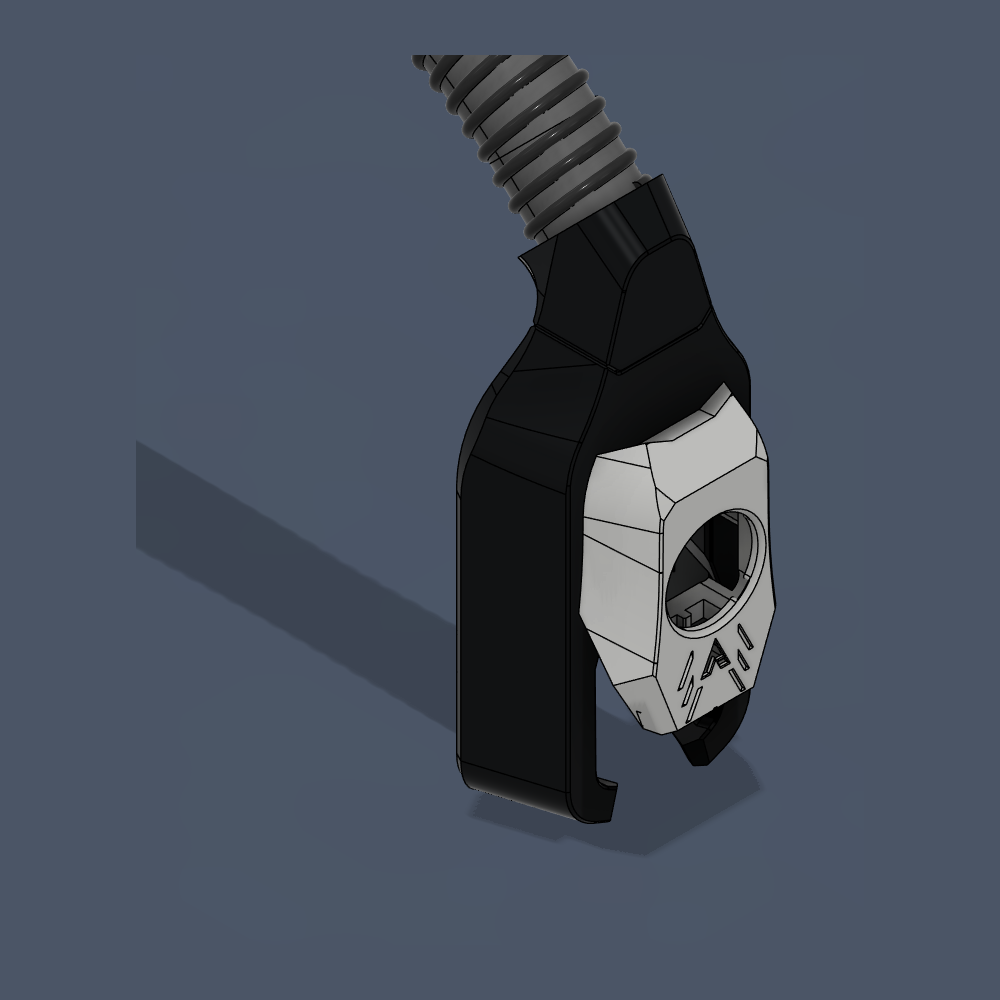

Breakneck is the Remote Cooling (CPAP) variant of the Archetype Toolhead Ecosystem.

It currently mainly uses 7040 blower fans, and requires the user to figure out mounting.

20mm ID ribbed tubing is also required

